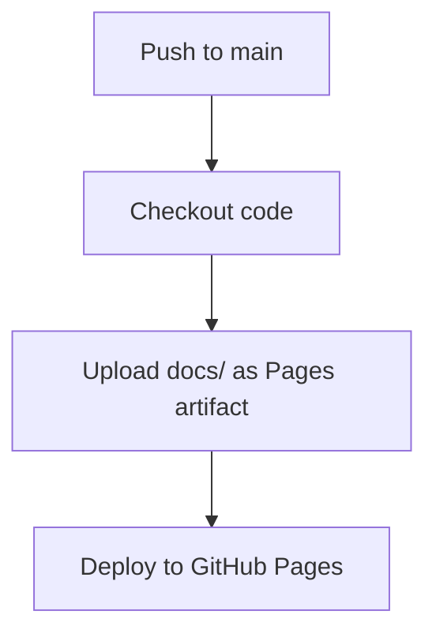

# Ymery Pyodide Web Demos

This directory contains the web-based interactive demo system for Ymery, powered by Pyodide to run Python code directly in the browser.

## 🌐 Live Demo

Visit the live demo at: `https://zokrezyl.github.io/ymery/`

## 📋 Overview

The Pyodide demo allows users to:
- **Edit YAML configuration** in an interactive editor
- **Load demo layouts from GitHub** automatically
- **Run Ymery demos** in real-time in their browser
- **See live ImGui rendering** via WebGL canvas
- **Switch between different example demos** from the repo

## 🏗️ Architecture

### How Pyodide Works

**Pyodide** is CPython compiled to WebAssembly, allowing Python to run directly in the browser.

```
┌─────────────────┐
│   Web Browser   │
├─────────────────┤
│  JavaScript     │ ← User interaction, code editor
│  ↓              │
│  Pyodide        │ ← Python interpreter (WebAssembly)
│  ↓              │
│  ymery package  │ ← Your Python code + YAML demos
│  ↓              │
│  imgui_bundle   │ ← ImGui rendering
│  ↓              │
│  WebGL Canvas   │ ← Visual output
└─────────────────┘
```

**Key Components:**

1. **Code Editor (CodeMirror)**: Allows users to edit Python code
2. **Pyodide Runtime**: Executes Python code in WebAssembly
3. **ImGui + HelloImGui**: Renders UI to WebGL canvas via Emscripten
4. **Ymery Package**: Bundled as a Python wheel, loaded into Pyodide

### Directory Structure

```
docs/
├── index.html              # Main page with editor + canvas
├── styles.css              # Styling
├── js/
│   ├── main.js            # App initialization and coordination
│   ├── pyodide_loader.js  # Pyodide initialization and package loading
│   ├── examples.js        # Example selection and loading
│   ├── ui.js              # UI management (editor, canvas, layout)
│   └── emscripten_canvas.js # Canvas handling for ImGui output
├── libs/                   # Third-party JS (CodeMirror, Tippy.js)
├── examples/
│   ├── examples.json      # List of available demos
│   ├── hello_world.py     # Simple Hello World demo
│   └── demo_full.py       # Full YAML-based demo loader
├── pyodide_dist/          # Pyodide distribution (built by CI, git-ignored)
│   ├── pyodide.js
│   ├── pyodide.asm.js
│   ├── packages/          # Python packages (numpy, imgui_bundle, etc.)
│   └── ymery-*.whl        # Ymery wheel
└── images/                # Logos and assets
```

## 📦 How YAML Files Are Packaged

### Problem: YAML Files Need to Be Accessible in Browser

Ymery demos are defined in YAML files under `demo/hello-imgui-full/`. For these to work in Pyodide:

1. **YAML files must be bundled inside the Python wheel**
2. **Demo files must be accessible at runtime**

### Solution: Package Data Configuration

In `pyproject.toml`:

```toml
[tool.hatch.build.targets.wheel.force-include]
"demo" = "ymery/demo"

[tool.hatch.build.targets.sdist]
include = [
    "src/ymery/**/*.py",
    "src/ymery/**/*.yaml",
    "demo/**/*",
]
```

This ensures:
- ✅ All `demo/**/*` files are copied to `ymery/demo/` inside the wheel
- ✅ All `*.yaml` files in `src/ymery/` are included
- ✅ When ymery is installed in Pyodide, YAML files are accessible via Python's package system

### Accessing YAML Files in Python

When running in Pyodide, the demo wrapper script sets up paths:

```python
# docs/examples/demo_full.py
import sys
from pathlib import Path

sys.argv = [
    'ymery',
    '--main', 'hello-imgui-full',
    '--layouts-path', str(Path(__file__).parent.parent / 'demo' / 'hello-imgui-full')
]

from ymery.app import main
main()
```

The ymery CLI (`--layouts-path`) tells the framework where to find YAML layouts.

## 🚀 GitHub Actions Pipeline

The `.github/workflows/deploy-pyodide-demo.yml` workflow deploys the demo to GitHub Pages.

### Pipeline Steps



### Detailed Workflow

1. **Trigger**: On push to `main` branch or manual workflow dispatch

2. **Deploy to GitHub Pages**:
   - Upload `docs/` directory as artifact
   - Deploy to GitHub Pages environment

### Why This Approach?

- **Simple**: Just static files, no build step
- **Fast**: No wheel building or Pyodide downloading
- **CDN-Powered**: Pyodide loaded from jsdelivr CDN
- **PyPI-Based**: Ymery installed from PyPI via micropip
- **Aggressive Caching**: CDN and browser cache everything efficiently

## 🔧 JavaScript Module Breakdown

### `pyodide_loader.js`

Initializes Pyodide from CDN and installs packages from PyPI:

```javascript
// Load Pyodide from CDN (loaded via script tag in index.html)
const pyodide = await loadPyodide();

// Install packages from PyPI via micropip
await pyodide.loadPackage(['numpy', 'pillow']);

// Install ymery from PyPI
await pyodide.runPythonAsync(`
    import micropip
    await micropip.install('ymery')
`);
```

### `examples.js`

Manages example selection and loading:

```javascript
// Load examples.json
const examples = await fetch('examples/examples.json');

// Populate dropdown
examples.forEach(ex => {
    dropdown.add(new Option(ex.label, ex.filename));
});

// Load selected example code
const code = await fetch(`examples/${filename}`);
editor.setValue(code);
```

### `ui.js`

Manages the split-pane layout (editor + canvas):

```javascript
Split(['#editor-container', '#canvas-container'], {
    sizes: [50, 50],
    minSize: 200,
    gutterSize: 10
});
```

### `emscripten_canvas.js`

Sets up the WebGL canvas for ImGui rendering:

```javascript
const canvas = document.getElementById('canvas');
const gl = canvas.getContext('webgl2');
// ImGui (via Emscripten) renders to this canvas
```

### `main.js`

Coordinates everything:

```javascript
// 1. Initialize UI
setupUI();

// 2. Load Pyodide
const pyodide = await loadPyodide();

// 3. Load examples
await loadExamples();

// 4. Run button handler
runButton.onclick = async () => {
    const code = editor.getValue();
    await pyodide.runPythonAsync(code);
};
```

## 🎯 How It All Works Together

### User Workflow

1. **User visits page**: `index.html` loads
2. **JavaScript initializes**:
   - CodeMirror editor created (YAML mode)
   - Pyodide loads (10-15 seconds)
   - Examples list populated from `examples.json`
3. **User selects example**:
   - `app.yaml` loaded from GitHub into editor
   - Example metadata stored
4. **User edits YAML** in the editor
5. **User clicks "Run"**:
   - Edited YAML written to Pyodide virtual filesystem
   - Ymery runs with `--layouts-url` pointing to GitHub
   - Imported YAML files downloaded automatically from GitHub
   - ImGui renders to WebGL canvas
   - User sees live interactive UI

### Example Execution Flow

```
User clicks "Run"
    ↓
JavaScript: pyodide.runPythonAsync(code)
    ↓
Pyodide: Execute Python code
    ↓
Python: from ymery.app import main
    ↓
Ymery: Load YAML from bundled demo/
    ↓
Ymery: Create widgets from YAML
    ↓
ImGui Bundle: Render widgets
    ↓
HelloImGui (Emscripten): Draw to WebGL canvas
    ↓
User sees: Interactive UI in browser
```

## 🛠️ Local Development

### Testing Locally

You can't just open `index.html` in a browser due to CORS restrictions. Run a local server:

```bash
# From the docs/ directory
python3 -m http.server 8000
```

Then visit: `http://localhost:8000`

**Note**: The demo will install ymery from PyPI, so make sure your latest changes are published to PyPI first if you want to test them.

## 📝 Adding New Examples

1. **Create Python script** in `docs/examples/`:

```python
# docs/examples/my_new_demo.py
from imgui_bundle import imgui, immapp

def main():
    imgui.text("My Custom Demo!")
    if imgui.button("Click"):
        print("Clicked!")

if __name__ == "__main__":
    immapp.run(main, window_title="My Demo")
```

2. **Register in examples.json**:

```json
{
  "examples": [
    {
      "label": "My New Demo",
      "filename": "my_new_demo.py"
    }
  ]
}
```

3. **Commit and push** → CI will rebuild and deploy

## ⚠️ Important Notes

### Pyodide Limitations

1. **No file system access**: Can't read/write to user's disk
2. **Limited packages**: Only packages compiled for Pyodide work
3. **Memory constraints**: Browser memory limits apply
4. **Performance**: Slower than native Python

### ImGui in Browser

- Uses **WebGL** for rendering (not native OpenGL)
- Compiled via **Emscripten** (C++ → WebAssembly)
- Some platform-specific features may not work

### YAML Demo Paths

If your demo uses relative paths or file loading:
- Ensure paths are relative to the package structure
- Use `importlib.resources` for accessing package data
- Test that paths work when bundled in wheel

## 🔍 Debugging

### Check Browser Console

All Python `print()` statements appear in browser console:

```python
print("Debug: value =", some_value)  # Shows in browser DevTools
```

### Pyodide Not Loading

- Check browser console for errors
- Verify `pyodide_dist/` exists and contains `pyodide.js`
- Check network tab to see if files are loading

### Demo Not Running

- Check if YAML files are in the wheel: `unzip -l dist/ymery-*.whl | grep demo`
- Verify layouts path in demo wrapper script
- Check Python exceptions in browser console

## 📚 References

- [Pyodide Documentation](https://pyodide.org/)
- [ImGui Bundle](https://github.com/pthom/imgui_bundle)
- [Emscripten](https://emscripten.org/)
- [GitHub Pages Deployment](https://docs.github.com/en/pages)

## 🤝 Contributing

To improve the demos:

1. Test locally using the local server
2. Add new examples in `docs/examples/`
3. Update `examples.json`
4. Test in browser before committing
5. Push to main → CI handles deployment

---

**Note**: The first load may take 10-15 seconds while Pyodide and dependencies download. Subsequent visits are faster due to browser caching.
